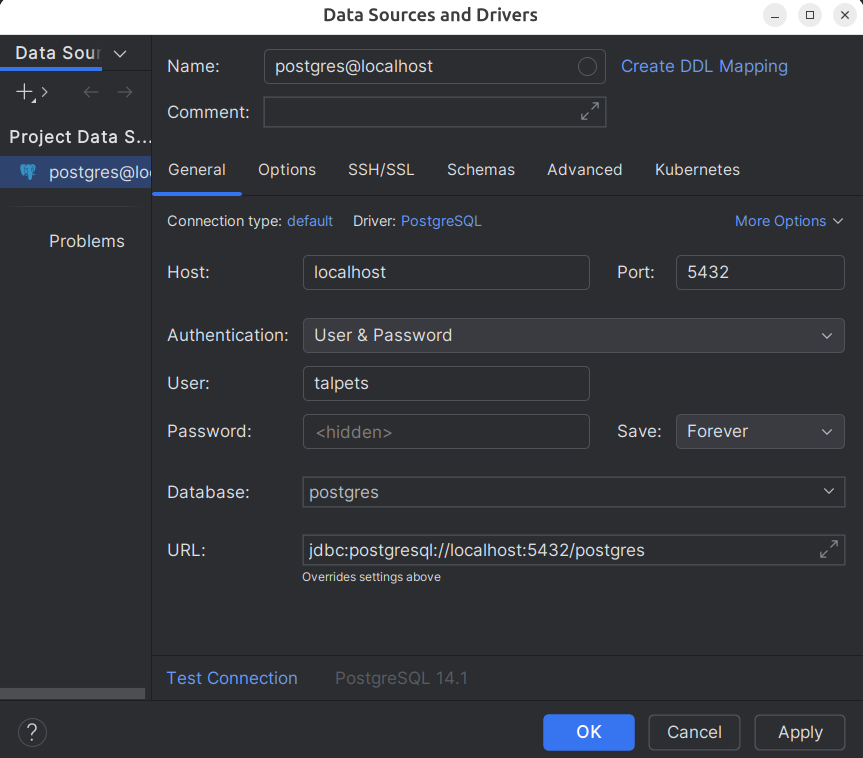

# TalPets Backend

## Table of Contents
- [How to run application](#how-to-run-application)
- [How to build a project](#how-to-build-a-project)
- [How to build and run docker container](#how-to-build-and-run-docker-container)
- [Technology stack listing](#technology-stack-listing)
- [Project introduction/purpose](#project-introductionpurpose)
- [Prerequisites/requirements](#prerequisitesrequirements)

---

## How to run application

### Set up the database (if running locally without Docker)

Create a PostgreSQL database (with password 'talpets'):


### Development Mode

Start the application with hot reload:

```bash
./gradlew bootRun
```

The application will be available at `http://localhost:8080`

### Access the application

- **Backend API**: `http://localhost:8080`
- **Swagger UI**: `http://localhost:8080/swagger-ui.html`
- 
---

## How to build a project

### Clone the repository

```bash
git clone https://github.com/your-username/iti0302-2025-backend.git
cd iti0302-2025-backend
```

### Install dependencies

```bash
./gradlew build
```

### Production Build

Create an optimized production JAR:

```bash
./gradlew build
```

Build output will be generated in the `build/libs/` directory.

### Clean build

Remove previous build artifacts and rebuild:

```bash
./gradlew clean build
```

---

## How to build and run docker container

### Build Docker Image

```bash
docker build -t talpets-backend:latest .
```

### Run Docker Container

```bash
docker run -d \
  -p 8080:8080 \
  -e DATABASE_URL=jdbc:postgresql://host.docker.internal:5432/postgres \
  -e DATABASE_USERNAME=talpets \
  -e DATABASE_PASSWORD=talpets \
  -e JWT_SECRET=local-jwt-secret-key-for-development-123 \
  --name talpets-backend \
  talpets-backend:latest
```

Access the application at `http://localhost:8080`

### Docker Compose

```bash
# Start all services (backend + database)
docker-compose up -d

# View logs
docker-compose logs -f

# Stop services
docker-compose down
```

### Stop and Remove Container

```bash
docker stop talpets-backend
docker rm talpets-backend
```

---

## Technology stack listing

**Backend:**
* Java 21
* Spring Boot 3.x
* Gradle
* Spring Security + JWT (authentication)
* Swagger/OpenAPI 3 (API documentation)
* MapStruct (for DTO mapping)
* Lombok
* Liquibase (database migrations)

**Domain:**
* No-IP

---

## Project introduction/purpose

This is the backend part of the TalPets project — an online store for pet merchandise created by and for the TalTech community.

It provides RESTful APIs for managing users, products, carts, wishlists, and comments, with PostgreSQL database integration and JWT authentication. The backend communicates with the frontend to serve product data, handle user authentication, manage shopping carts and wishlists, and process user comments.

---

## Prerequisites/requirements

Before you begin, ensure you have the following installed:

- **Java**: version 21 or higher
- **Gradle**: version 8.x or higher (or use the included Gradle wrapper)
- **Docker** (optional): version 20.x or higher for containerized deployment
- **Git**: for cloning the repository

To check your versions:
```bash
java -version
gradle -version
docker --version
git --version
```
